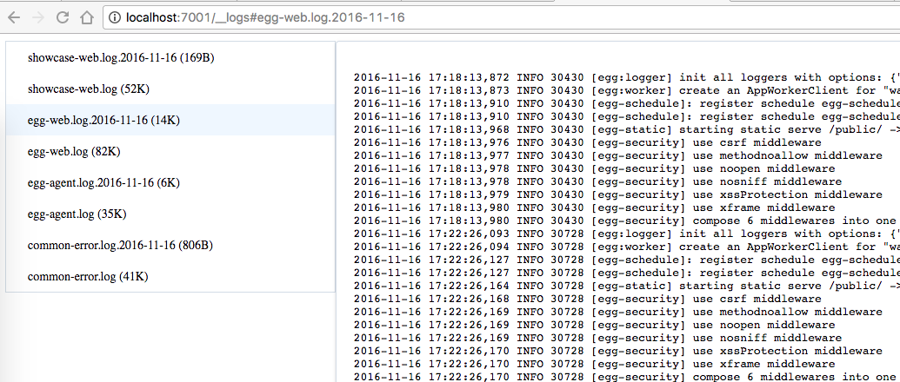

# egg-logview

[![NPM version][npm-image]][npm-url]
[![build status][travis-image]][travis-url]
[![Test coverage][codecov-image]][codecov-url]
[![David deps][david-image]][david-url]
[![Known Vulnerabilities][snyk-image]][snyk-url]
[![npm download][download-image]][download-url]

[npm-image]: https://img.shields.io/npm/v/egg-logview.svg?style=flat-square
[npm-url]: https://npmjs.org/package/egg-logview
[travis-image]: https://img.shields.io/travis/eggjs/egg-logview.svg?style=flat-square
[travis-url]: https://travis-ci.org/eggjs/egg-logview
[codecov-image]: https://img.shields.io/codecov/c/github/eggjs/egg-logview.svg?style=flat-square
[codecov-url]: https://codecov.io/github/eggjs/egg-logview?branch=master
[david-image]: https://img.shields.io/david/eggjs/egg-logview.svg?style=flat-square
[david-url]: https://david-dm.org/eggjs/egg-logview
[snyk-image]: https://snyk.io/test/npm/egg-logview/badge.svg?style=flat-square
[snyk-url]: https://snyk.io/test/npm/egg-logview
[download-image]: https://img.shields.io/npm/dm/egg-logview.svg?style=flat-square
[download-url]: https://npmjs.org/package/egg-logview

Provide a log files viewer for development purpose.



## Install

```bash
$ npm i egg-logview --save
```

## Usage

```js
// {app_root}/config/plugin.js
exports.logview = {
  package: 'egg-logview',
  // env: ['local', 'default', 'test', 'unittest']
};
```

## Configuration

```js
// {app_root}/config/config.default.js
/**
 * logview default config
 * @member Config#logview
 * @property {String} prefix - logview route prefix, default to `__logs`
 * @property {String} dir - logview dir, default to `app.config.logger.dir`
 */
exports.logview = {
};
```

## Example

Visit `http://127.0.0.1:7001/__logs`

## Questions & Suggestions

Please open an issue [here](https://github.com/eggjs/egg/issues).

## License

[MIT](LICENSE)
